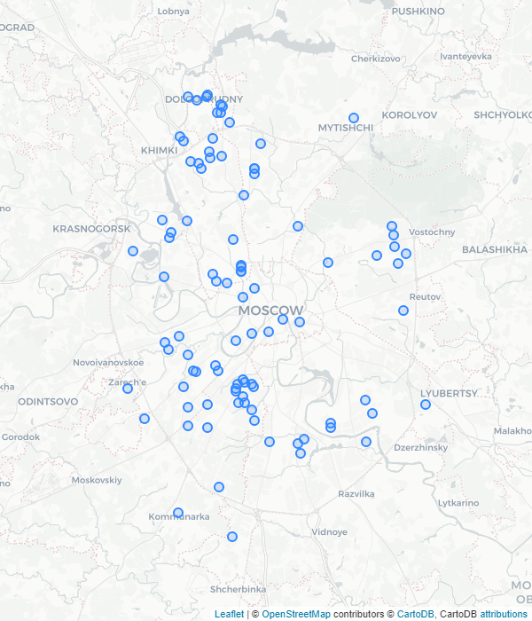

# Mapping air pollution data by [breathe.moscow](https://breathe.moscow/)
Sample outputs

1. Map of sensors active in December 2019

2. Map of sensors colored by average PM10 values on 27 December 2019

